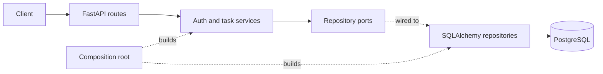
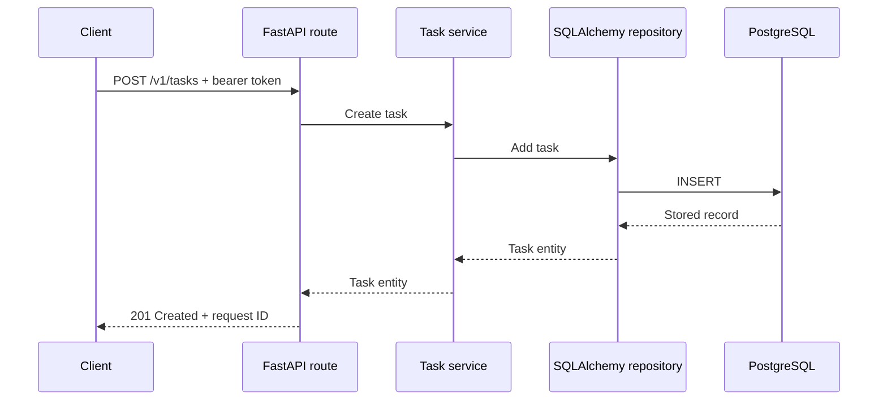

# REST API

A FastAPI task service for learning validation, authentication, Clean Architecture, PostgreSQL transactions, logging, and testing.

## Architecture

Routes translate HTTP requests into application calls. Services own the use cases and depend on repository interfaces; SQLAlchemy implements those interfaces. `main.py` connects the layers.



## Request flow

An authenticated request enters through a route, which calls the application service. The service applies the use case through a repository interface. The SQLAlchemy adapter performs the database work, then the request transaction commits or rolls back.



## Run locally

```bash
cp .env.example .env
make sync
make services
make migrate
make run
```

## API

| Method | Endpoint | Purpose |
|--------|----------|---------|
| `GET` | `/health` | Check whether the API is running. |
| `POST` | `/v1/auth/register` | Register a user. |
| `POST` | `/v1/auth/token` | Create an access token. |
| `GET` | `/v1/tasks` | List the current user's tasks. |
| `POST` | `/v1/tasks` | Create a task. |
| `GET` | `/v1/tasks/{task_id}` | Retrieve a task. |
| `PATCH` | `/v1/tasks/{task_id}` | Update a task. |
| `DELETE` | `/v1/tasks/{task_id}` | Delete a task. |

## Test

```bash
make check
```
