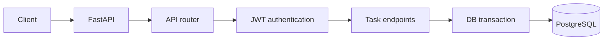
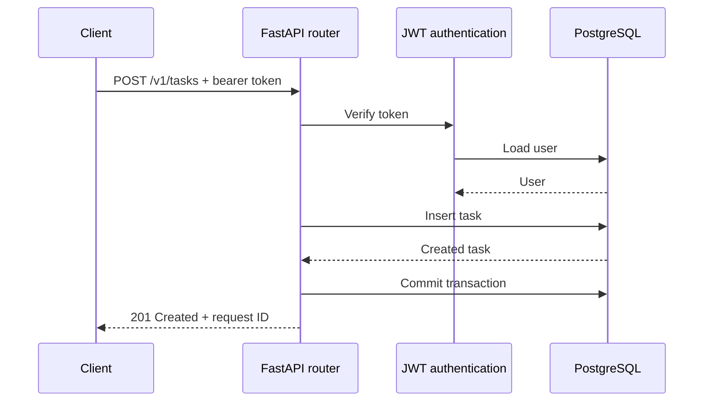

# REST API

A FastAPI task service for learning validation, authentication, PostgreSQL transactions, logging, and integration testing.

## Architecture

FastAPI validates requests, the router selects an endpoint, JWT authentication identifies the user, and each request runs in a database transaction.



## Request flow

Authenticated task requests verify the bearer token, load the current user, execute the operation, and commit or roll back the transaction.



## Run locally

```bash
cp .env.example .env
make sync
make services
make migrate
make run
```

## API

| Method | Endpoint | Purpose |
|--------|----------|---------|
| `GET` | `/health` | Check whether the API is running. |
| `POST` | `/v1/auth/register` | Register a user. |
| `POST` | `/v1/auth/token` | Create an access token. |
| `GET` | `/v1/tasks` | List the current user's tasks. |
| `POST` | `/v1/tasks` | Create a task. |
| `GET` | `/v1/tasks/{task_id}` | Retrieve a task. |
| `PATCH` | `/v1/tasks/{task_id}` | Update a task. |
| `DELETE` | `/v1/tasks/{task_id}` | Delete a task. |

## Test

```bash
make check
```
