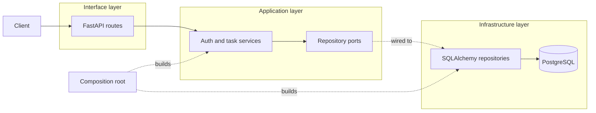
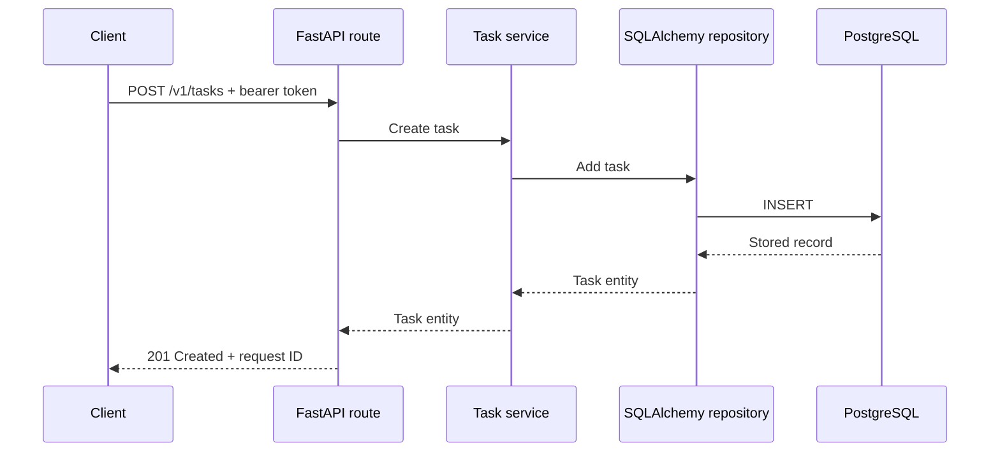

# REST API

A FastAPI task service for learning validation, authentication, Clean Architecture, PostgreSQL transactions, logging, and testing.

## Architecture

Routes translate HTTP requests into application calls. Services own the use cases and depend on repository ports; SQLAlchemy implements those ports. The groups only organize the original flow by layer.



## Structure

The project uses one shallow directory per Clean Architecture layer.

```text
app/
├── domain/
├── application/
├── interface/
├── infrastructure/
├── config.py
├── logging.py
└── main.py
```

| Layer | Files |
| --- | --- |
| Domain | [Entities](app/domain/entities.py) |
| Application | [Services](app/application/services.py), [ports](app/application/ports.py), [errors](app/application/errors.py) |
| Interface | [Auth routes](app/interface/auth.py), [task routes](app/interface/tasks.py), [schemas](app/interface/schemas.py), [dependencies](app/interface/dependencies.py), [errors](app/interface/errors.py) |
| Infrastructure | [Repositories](app/infrastructure/repositories.py), [database models](app/infrastructure/models.py), [database](app/infrastructure/database.py), [security](app/infrastructure/security.py) |
| Composition | [Configuration](app/config.py), [logging](app/logging.py), [main](app/main.py) |
| Support | [Migrations](migrations/), [tests](tests/), [Makefile](Makefile) |

[Architecture tests](tests/test_architecture.py) prevent inner layers from importing frameworks or outer layers.

## Request flow

An authenticated request enters through a route, which calls the application service. The service applies the use case through a repository interface. The SQLAlchemy adapter performs the database work, then the request transaction commits or rolls back.



## Run locally

```bash
cp .env.example .env
# Replace REST_API_JWT_SECRET before starting the API.
make sync
make services
make migrate
make run
```

## API

| Method | Endpoint | Purpose |
|--------|----------|---------|
| `GET` | `/health` | Check whether the API is running. |
| `POST` | `/v1/auth/register` | Register a user. |
| `POST` | `/v1/auth/token` | Create an access token. |
| `GET` | `/v1/tasks?limit=50&offset=0` | List the current user's tasks. |
| `POST` | `/v1/tasks` | Create a task. |
| `GET` | `/v1/tasks/{task_id}` | Retrieve a task. |
| `PATCH` | `/v1/tasks/{task_id}` | Update a task. |
| `DELETE` | `/v1/tasks/{task_id}` | Delete a task. |

## Test

```bash
make check
```

## Production checklist

- Set `REST_API_ENVIRONMENT=production` and a random JWT secret of at least 32 characters.
- Run `make migrate` before starting new application replicas.
- Put the API behind TLS, request-size limits, and rate limiting.
- Use managed PostgreSQL backups and export logs and metrics to your observability system.
