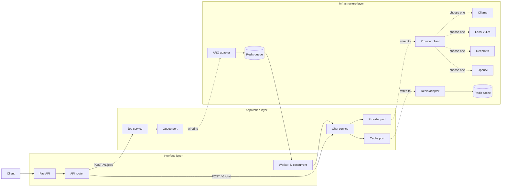
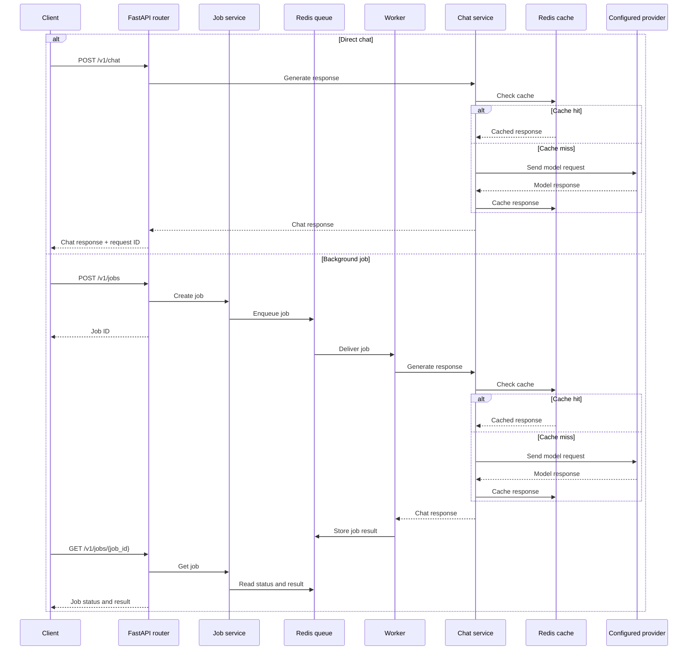

# LLM API

A FastAPI service for direct LLM chat requests and queued background jobs, built to demonstrate essential backend techniques.

## What it includes

- Synchronous and queued chat requests
- OpenAI-compatible model provider
- Async HTTP calls with timeouts and retries
- Redis caching, queues, and workers
- Structured logging and integration tests

## Architecture

Routes call application services through the direct or queued path. The groups only organize the original flow by layer. Workers process up to **N jobs concurrently** (`max_jobs`, default: 10).



## Structure

The project uses one shallow directory per Clean Architecture layer.

```text
app/
├── domain/
├── application/
├── interface/
├── infrastructure/
├── config.py
├── logging.py
├── main.py
└── worker.py
```

| Layer | Files |
| --- | --- |
| Domain | [Chat and job data](app/domain/models.py) |
| Application | [Services](app/application/services.py), [ports](app/application/ports.py) |
| Interface | [API routes](app/interface/api.py), [schemas](app/interface/schemas.py), [dependencies](app/interface/dependencies.py), [worker handler](app/interface/worker.py) |
| Infrastructure | [Redis cache](app/infrastructure/cache.py), [provider client](app/infrastructure/provider.py), [ARQ queue](app/infrastructure/queue.py) |
| Composition | [Configuration](app/config.py), [logging](app/logging.py), [API](app/main.py), [worker](app/worker.py) |
| Support | [Tests](tests/), [Makefile](Makefile) |

[Architecture tests](tests/test_architecture.py) prevent inner layers from importing frameworks or outer layers. The worker handler stays in the interface layer; only its composition root knows Redis and the provider adapter.

## How it works

**Direct chat:** The API checks Redis first. A cache hit returns immediately; a cache miss calls the LLM provider, stores the response, and returns it to the client.

**Background job:** The API queues the request and immediately returns a job ID. A worker runs the same cache-first chat service, stores the job result in Redis, and the client retrieves it through the job-status endpoint.



## Run locally

```bash
cp .env.example .env
make sync
make services
make run
```

Start the worker in another terminal:

```bash
make worker
```

## API

| Method | Endpoint | Purpose |
|--------|----------|---------|
| `GET` | `/health` | Check whether the API is running. |
| `POST` | `/v1/chat` | Process a chat request and wait for the response. |
| `POST` | `/v1/jobs` | Queue a chat request and return a job ID immediately. |
| `GET` | `/v1/jobs/{job_id}` | Retrieve a queued job's status and result. |

Example request:

```bash
curl http://localhost:8000/v1/chat \
  -H 'Content-Type: application/json' \
  -d '{"messages":[{"role":"user","content":"Explain async I/O briefly."}]}'
```

## Test

```bash
make check
```
