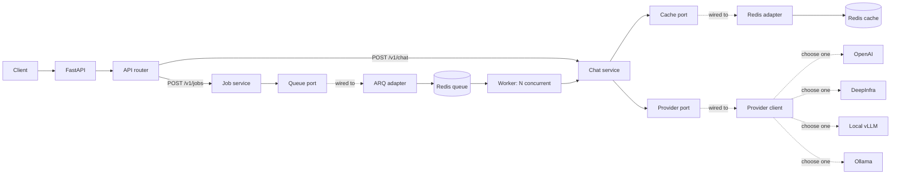
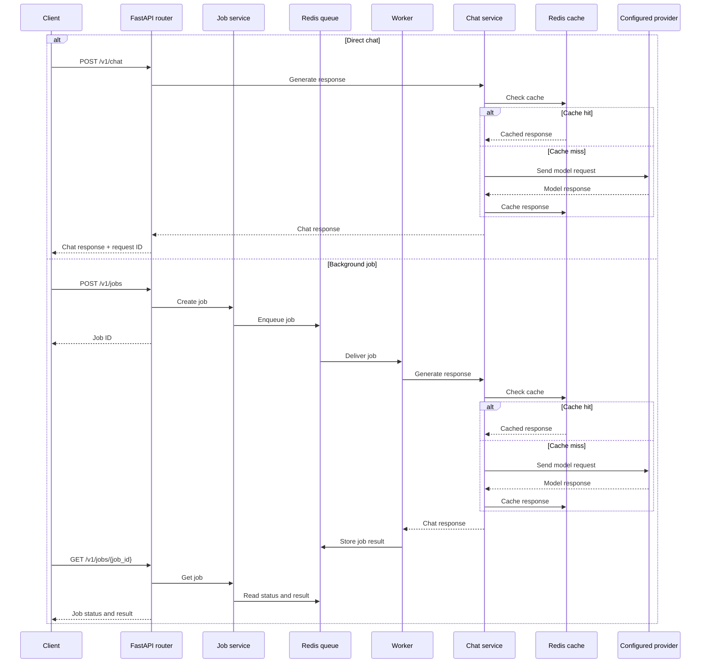

# LLM API

A FastAPI service for direct LLM chat requests and queued background jobs, built to demonstrate essential backend techniques.

## What it includes

- Synchronous and queued chat requests
- OpenAI-compatible model provider
- Async HTTP calls with timeouts and retries
- Redis caching, queues, and workers
- Structured logging and integration tests

## Architecture

Routes call application services, which depend only on cache, queue, and provider interfaces. Redis, ARQ, and the provider client implement those interfaces; `main.py` connects them. Queued requests wait until a worker can process them, up to **N concurrently** (`max_jobs`, default: 10).



## How it works

**Direct chat:** The API checks Redis first. A cache hit returns immediately; a cache miss calls the LLM provider, stores the response, and returns it to the client.

**Background job:** The API queues the request and immediately returns a job ID. A worker runs the same cache-first chat service, stores the job result in Redis, and the client retrieves it through the job-status endpoint.



## Run locally

```bash
cp .env.example .env
make sync
make services
make run
```

Start the worker in another terminal:

```bash
make worker
```

## API

| Method | Endpoint | Purpose |
|--------|----------|---------|
| `GET` | `/health` | Check whether the API is running. |
| `POST` | `/v1/chat` | Process a chat request and wait for the response. |
| `POST` | `/v1/jobs` | Queue a chat request and return a job ID immediately. |
| `GET` | `/v1/jobs/{job_id}` | Retrieve a queued job's status and result. |

Example request:

```bash
curl http://localhost:8000/v1/chat \
  -H 'Content-Type: application/json' \
  -d '{"messages":[{"role":"user","content":"Explain async I/O briefly."}]}'
```

## Test

```bash
make check
```
