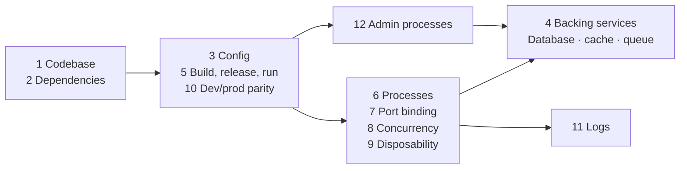

# Backend

Learn practical backend engineering through small notebooks and complete FastAPI projects.

## Projects

Each project combines the most important techniques from the topics below.

1. **[REST API](00P1-project-rest-api/)** — Task CRUD, validation, authentication, PostgreSQL transactions, logging, and integration tests.
2. **[LLM API](00P2-project-llm-api/)** — Direct chat, queued jobs, Redis, concurrent workers, caching, retries, and provider calls.

**Guide:** [Clean Architecture](clean-architecture.md) — understand routes, use cases, protocols, adapters, and dependency wiring in both projects.

## Setup

Requires Python 3.12 or newer and [uv](https://docs.astral.sh/uv/).

```bash
make sync
make kernel
```

Open a notebook and select **Python (backend-learning)**. Run all notebooks with `make test`.

Each notebook starts with a small example, ends with a production-shaped version, and links to its real project implementation where applicable.

## Topics

### 01 — Python engineering

**Objective:** Write clear Python and separate business logic from implementation details.

- [Basic Python](01-python-engineer/basic-python.ipynb) — types, exceptions, data classes, protocols, dependency management, and project structure.

### 02 — HTTP APIs

**Objective:** Build predictable APIs with clear inputs, outputs, errors, and module boundaries.

- [HTTP](02-http-api/http.ipynb) — methods, status codes, headers, and responses.
- [REST](02-http-api/rest.ipynb) — resource-oriented routes and CRUD behavior.
- [Validation](02-http-api/validation.ipynb) — normalization, field limits, and total request limits.
- [Authentication](02-http-api/auth.ipynb) — Argon2, worker-thread hashing, JWTs, and API keys.
- [Dependency injection](02-http-api/di.ipynb) — replaceable dependencies.
- [API errors](02-http-api/api-errors.ipynb) — centralized domain-to-HTTP error mapping.
- [Modular API](02-http-api/modular-api.ipynb) — router, service, repository, and app factory.

### 03 — Databases

**Objective:** Store and query data safely without coupling business logic to persistence details.

- [SQL](03-database/sql.ipynb) — parameters, joins, and read repositories.
- [Schema](03-database/schema.ipynb) — constraints, relationships, and ownership.
- [Transactions](03-database/transactions.ipynb) — request-scoped commit and rollback.
- [Indexes](03-database/indexes.ipynb) — composite indexes and query plans.
- [Migrations](03-database/migrations.ipynb) — versioned schema changes.
- [ORM](03-database/orm.ipynb) — SQLAlchemy models, sessions, and repositories.

### 04 — Async and concurrency

**Objective:** Run independent work concurrently while controlling blocking, time, and shared state.

- [Async and await](04-async/async-await.ipynb) — concurrent I/O through async interfaces.
- [Tasks](04-async/tasks.ipynb) — task creation and structured concurrency.
- [Threads](04-async/threads.ipynb) — wrapping blocking I/O with `to_thread`.
- [Processes](04-async/processes.ipynb) — isolated CPU work through subprocesses.
- [Race conditions](04-async/race.ipynb) — locks and small critical sections.
- [Timeouts](04-async/timeouts.ipynb) — bounded calls and domain-specific failures.

### 05 — Caching and background jobs

**Objective:** Reduce repeated work and process jobs safely with bounded concurrency.

- [Cache aside](05-cache-jobs/cache.ipynb) — namespaced keys and cache failure fallback.
- [Redis](05-cache-jobs/redis.ipynb) — serialization, expiration, deletion, and connection lifecycle.
- [Invalidation](05-cache-jobs/invalidation.ipynb) — removing stale cached data after writes.
- [Queue](05-cache-jobs/queue.ipynb) — job states from enqueue to completion.
- [Kafka](05-cache-jobs/kafka.ipynb) — idempotent publishing, partition keys, manual offsets, and dead letters.
- [RabbitMQ](05-cache-jobs/rabbitmq.ipynb) — durable topology, publisher confirms, prefetch, acknowledgements, and dead letters.
- [Retries](05-cache-jobs/retries.ipynb) — retryable errors and exponential backoff.
- [Idempotency](05-cache-jobs/idempotency.ipynb) — preventing duplicate side effects.
- [Workers](05-cache-jobs/workers.ipynb) — bounded worker pools and clean shutdown.

**Durability lab:** Run `make brokers-up`, follow the optional publish/recreate/consume cells in the Kafka or RabbitMQ notebook, then run `make brokers-down`. `make brokers-reset` deletes the saved messages.

### 06 — Reliability and testing

**Objective:** Make service behavior observable and verify it at the right boundaries.

- [Logging](06-reliability-test/logging.ipynb) — structured events with request context.
- [Metrics](06-reliability-test/metrics.ipynb) — counters, durations, and instrumentation boundaries.
- [Health checks](06-reliability-test/health.ipynb) — separate liveness and readiness.
- [Unit tests](06-reliability-test/unit-test.ipynb) — fast business tests with in-memory fakes.
- [Integration tests](06-reliability-test/integration-test.ipynb) — testing HTTP, validation, and storage together.
- [Mocking](06-reliability-test/mocking.ipynb) — replacing and verifying external dependencies.
- [Fixtures](06-reliability-test/fixtures.ipynb) — reusable setup with fresh state.

### 07 — Twelve-Factor App

**Objective:** Apply the [Twelve-Factor App](https://12factor.net/) principles so a service is reproducible, portable, scalable, and easier to operate.

A service moves from versioned source to a configured release, then runs as replaceable processes connected to external state and logs. Administrative commands use the same release.



The arrows show deployment relationships, not an official implementation order.

1. [Codebase](07-twelve-factor/codebase.ipynb)
2. [Dependencies](07-twelve-factor/dependencies.ipynb)
3. [Config](07-twelve-factor/config.ipynb)
4. Backing services — [Redis](05-cache-jobs/redis.ipynb) · [Queue](05-cache-jobs/queue.ipynb)
5. [Build, release, run](07-twelve-factor/release.ipynb)
6. [Processes](07-twelve-factor/processes.ipynb)
7. [Port binding](07-twelve-factor/port.ipynb)
8. [Concurrency](07-twelve-factor/concurrency.ipynb)
9. [Disposability](07-twelve-factor/disposability.ipynb)
10. [Dev/prod parity](07-twelve-factor/parity.ipynb)
11. [Logs](06-reliability-test/logging.ipynb)
12. [Admin processes](03-database/migrations.ipynb)

[Open the concise Twelve-Factor index](07-twelve-factor/).
