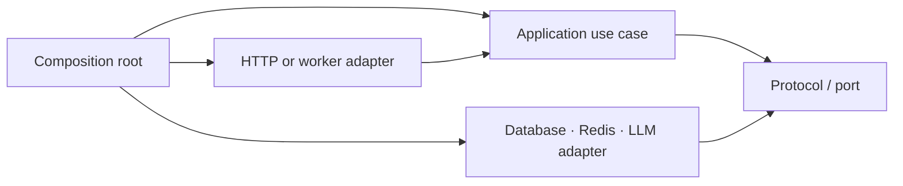

# Clean Architecture

**Objective:** Understand the code by separating business decisions from HTTP, databases, Redis, queues, and external APIs.

## Core rule

Source-code dependencies point toward business policy. Inner code defines what it needs; outer code implements those needs with frameworks and services.

The arrows mean “knows about or calls.” The use case knows a protocol, but it does not need to know which adapter implements it.

## Layers in this repository

| Layer | Responsibility | Examples |
| --- | --- | --- |
| Domain | Holds business entities and data without framework dependencies | [REST entities](00P1-project-rest-api/app/domain/entities.py), [LLM data](00P2-project-llm-api/app/domain/models.py) |
| Application use cases | Make business decisions and coordinate work | [REST services](00P1-project-rest-api/app/application/services.py), [LLM services](00P2-project-llm-api/app/application/services.py) |
| Ports | Define capabilities required by a use case | [REST ports](00P1-project-rest-api/app/application/ports.py), [LLM ports](00P2-project-llm-api/app/application/ports.py) |
| Inbound adapters | Translate HTTP or queued jobs into application calls | [LLM API routes](00P2-project-llm-api/app/interface/api.py), [worker](00P2-project-llm-api/app/interface/worker.py), [REST interface](00P1-project-rest-api/app/interface/) |
| Outbound adapters | Translate application calls into external operations | [REST repositories](00P1-project-rest-api/app/infrastructure/repositories.py), [Redis cache](00P2-project-llm-api/app/infrastructure/cache.py), [provider client](00P2-project-llm-api/app/infrastructure/provider.py), [ARQ queue](00P2-project-llm-api/app/infrastructure/queue.py) |
| Composition root | Creates adapters and connects them to the application | [LLM API](00P2-project-llm-api/app/main.py), [LLM worker](00P2-project-llm-api/app/worker.py), [REST API](00P1-project-rest-api/app/main.py) |

Both projects keep the layers in short files rather than a deeply nested directory tree. The important separation is enforced by imports: application services know ports and entities, not FastAPI, SQLAlchemy, Redis, ARQ, or HTTP clients.

## LLM API: the clearest example

### Direct chat

`POST /v1/chat` follows this path:

1. [api.py](00P2-project-llm-api/app/interface/api.py) receives and validates the HTTP request.
2. [ChatService](00P2-project-llm-api/app/application/services.py) applies the cache-first use case.
3. The service calls the `Cache` and `LLMProvider` protocols in [ports.py](00P2-project-llm-api/app/application/ports.py).
4. [RedisCache](00P2-project-llm-api/app/infrastructure/cache.py) and [OpenAICompatibleProvider](00P2-project-llm-api/app/infrastructure/provider.py) perform external I/O.
5. [main.py](00P2-project-llm-api/app/main.py) chooses those concrete adapters and connects them.

The important dependency is:

`API → ChatService → ports ← Redis and provider adapters`

Because `ChatService` receives its dependencies, [tests](00P2-project-llm-api/tests/test_api.py) can supply fakes without Redis or a live model.

### Queued chat

`POST /v1/jobs` changes only the entry path:

1. [api.py](00P2-project-llm-api/app/interface/api.py) calls `JobService`.
2. `JobService` uses the `JobQueue` port.
3. [ArqJobQueue](00P2-project-llm-api/app/infrastructure/queue.py) stores the job in Redis.
4. [worker.py](00P2-project-llm-api/app/interface/worker.py) receives the job.
5. The worker calls the same `ChatService`, so caching and provider behavior stay consistent.

## REST API

The REST project now follows this path:

`Route → Service → Repository port ← SQLAlchemy repository`

Each part has one role:

- [schemas.py](00P1-project-rest-api/app/interface/schemas.py) defines HTTP input and output shapes.
- [entities.py](00P1-project-rest-api/app/domain/entities.py) defines plain business entities.
- [services.py](00P1-project-rest-api/app/application/services.py) owns authentication and task use cases.
- [ports.py](00P1-project-rest-api/app/application/ports.py) defines repository and security requirements.
- [repositories.py](00P1-project-rest-api/app/infrastructure/repositories.py) implements persistence with SQLAlchemy.
- [security.py](00P1-project-rest-api/app/infrastructure/security.py) implements password and token ports.
- [interface](00P1-project-rest-api/app/interface/) translates application results and errors into HTTP.
- [main.py](00P1-project-rest-api/app/main.py) connects the concrete adapters to the services.

[test_services.py](00P1-project-rest-api/tests/test_services.py) replaces SQLAlchemy with an in-memory repository, demonstrating that a use case can run without FastAPI or a database.

Both projects also include [REST](00P1-project-rest-api/tests/test_architecture.py) and [LLM](00P2-project-llm-api/tests/test_architecture.py) architecture tests that reject outward layer imports and framework imports from inner layers.

## Production boundaries

The projects include validated configuration, application-level errors, transaction and resource cleanup, external-I/O timeouts, authentication, structured logs, and automated tests. Production deployment must still supply TLS, rate limiting, secret management, monitoring, and reliable PostgreSQL or Redis infrastructure.

## How to read the code

Read from the center outward:

1. Start with the polished version of [Basic Python](01-python-engineer/basic-python.ipynb) to understand protocols and dependency injection.
2. Study [Modular API](02-http-api/modular-api.ipynb) for router, service, and repository roles.
3. Read the [LLM HTTP schemas](00P2-project-llm-api/app/interface/schemas.py), [application data](00P2-project-llm-api/app/domain/models.py), then [ChatService](00P2-project-llm-api/app/application/services.py).
4. Find the protocols used by the service, then their Redis and HTTP adapters.
5. Read [main.py](00P2-project-llm-api/app/main.py) last to see how the pieces are assembled.
6. Compare a REST route, its service method, and its SQLAlchemy repository method.

For every file, ask:

- What decision does this code own?
- Is it business policy, an interface, or an external implementation?
- Which direction do its imports point?
- Can its behavior be tested without starting FastAPI, PostgreSQL, Redis, or an LLM?
